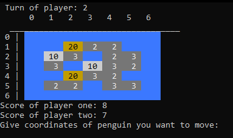

<h1 align="center">

  Hey that's my fish, C
   
</h1>

<h4 align="center">Task made with colleagues for uni classes</h4>
<h4 align="center">Program allowing playing "Hey, that's my fish game against your friend loccaly"</h4>

 
 

  
* Rules
  - penguins can only be put on a tile with one fish on it
  - penguins can't move diagonally
  - move is compulsory
  - the game ends when no penguin can make a move or when all fish are collected
  - players make moves in turns
  

